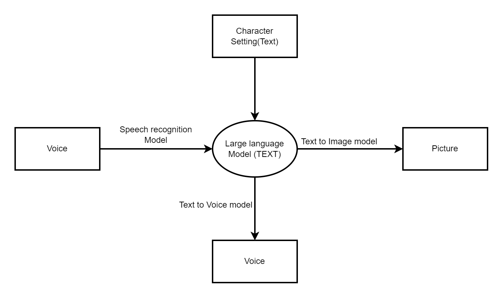

# CyberHuman

## Description
This Project is dedicated to the simulated conversation in real life with chatbot. it means we can directly talk with chatbot by voice, and "see" chatbot.

## Workflow

## Current Features
1. People can talk with Chatbot by voice --update 8/9/2023
2. People can use Chinese to talk Chatbot  --update 8/9/2023
3. Initial GUI   --update 8/9/2023
4. Enable image generated by stable diffusion, but we need to install sd_webui and set up the API at first. 

## Demo

## Next Step
1. include the Text to Image model stable diffusion.
2. 

## Installation and Running
Environment dependency:
1. ffmpeg

## Credits

